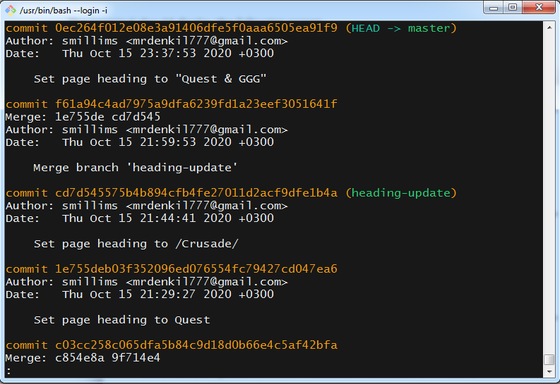
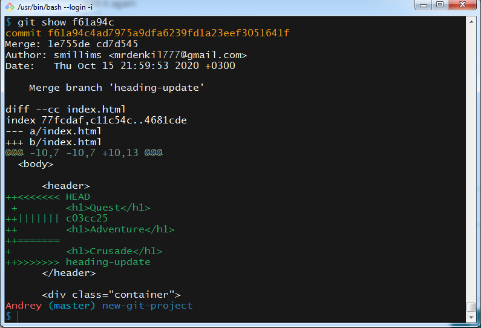

# kottans-frontend
In this repository I will write about the work with which I dealt and I will write reports on the lessons I have learned, so have fun (smile)


## Notes

- [X] *0. [Markdown](#markdown)*
- [ ] *1. [Git Basics](#git)*
   - [X] *1.1 [Version Control with Git](#version)*
   
## Markdown

   The first innovation that I have discovered for myself is that you need to use **markdown** formatting to edit text, and what's even funnier is that you need to style everything ***with your own hands***, without using pre-prepared buttons.

---

1. From the very beginning, everything was difficult and unusual, but after sitting and studying the information for two days I can say, that this is not such a difficult topic for me. Now I'm going to show you (and remind myself) some commands, each of which fulfills different functions.

- For examle you can stylized your own **header**:
   
   | Symbol | Heading text |
   | :--- | :---: |
   | `#` | Like `h1` header |
   | `###` | Like `h3` header |
   
   - and etc., when end at six `#` symblols

---

2. To your attantion I want to present command with which you're be able to use ordered/unordered **lists**. Above you can see example unordered lists. But from below will already be presented commands for created list:

```
- Kottans
- Front-end
- Course
```
- Kottans
- Front-end
- Course

```
1. Git
2. is a distributed
3. version-control system
```

1. Git
2. is a distributed
3. version-control system

---

3. Okay, let's move. Further I was shoked by creating **table**. Not the table itself, no no :grin:, specifically ***table creation***, I'll show you now:

   ```
   | HTML | CSS | JavaScript | Python |
   | --- | --- | --- | --- |
   | :heavy_check_mark: | :heavy_check_mark: | :x: | :x: |
   ```

   | HTML | CSS | JavaScript | Python |
   | --- | --- | --- | --- |
   | :heavy_check_mark: | :heavy_check_mark: | :x: | :x: |

   - The table shows the markup and program languages which I use/not use

---
---

***IN CONCLUSION***: Yeah, generally markdown it's basic, but in all that's information was new for me. I spent some of my time on learning, because of that I should to write about it here. On the whole, finishing. In notes I described just a little part of all, that I had to find out, not to mention stylized text (by the way, which I'm using), about code blocks (which I use too ! ), emogi, [design elements](https://shields.io/) and few different items.

---
---

## Git Basics
### Version Control with Git

----

> Git is a free and open source distributed version control system designed 
>> to handle everything from small to very large projects 
>>> with speed and efficiency.

----

***My expectations [course about Git](https://classroom.udacity.com/courses/ud123)***: I didn't know what to expact, besause before that I had no idea what is Git and what is he like (forgive me Mark Zuckerberg).

---

Let's break everything down:

- As soon as I have started lerning course and generelly found out what's version control system - I was very suprised. Exactly from that we use this system, I, and almost every   user use it for a long time and even didn't notice it. What I'm talking about? Do you know about this key combination as `ctrl + z`? Do you know what this key combination do?   It's used to undo the last action (for examle, to deletion text (i think you alredy knew it)).

  - Moreover this only a small part of version control system.

 - Then I had a difficult time for exposition terminology, here are some points:
   - Repository/repo: storage for storing your works (files), and few files, which are used for collaboration with Git.
   - A version control system (abbreviated as VCS) this is tool with which you can manage version control.
   - Branch - creation new branch for you repo in which you can safely change file that you need without touching a main branch.
     - Also you can merge branches, but let's speek about it a little bit later.
    
- After that installation Git on Windows, nothing complicated, everything okay.

- Further, at every lesson I have learnt different commands, similiarly i will sort this commands in different blocks.

---

#### Lesson 2: Create A Git Repo

   | Command | What is it mean? |
   | --- | --- |
   | `git init` | Create brand new repositories |
   | `git clone` | Copy existing repo from somewhere else to your local computer |
   | `git status` | Check the status of a repo |
    
- And the most important detail: ***always, hear, always*** use command `git status`.

---

#### Lesson 3: Review a Repo's History

   | Command | What is it mean? |
   | --- | --- |
   | `git log` | Displays information about the existing commits |
   | ~~Showing how the terminal looks like~~ |  |
   | `git show` | Dislays information about just that one commit |
   | Typically, a SHA is provided as a final argumen |  |
 
 - When do we use the command `git log`, terminal outputs to us all available information: abous SHA, about author, date when was made last change and commit. What if we only      want to see SHA and commit, what if we need to show just the only line? For this we can use ***flag***. Flags could used for changing program work or changing display this      or that command in terminal.
   - For example, `git log --oneline` displayed just the short SHA and the commit message in one line.
   - The `git log` command has a flag that can be used to display the files that have been changed in the commit, as well as the number of lines that have been added or               deleted. The flag is `--stat`.
   - `git log` has one more comman, which shows **where ___exactly___*** was produced change file. This command is named `--patch`, but nobody wants to write constantly `--        patch`, because of that you can use this command like `git log -p`.
   
---

#### Lesson 4: Add Commit To A Repo

   | Command | What is it mean? |
   | --- | --- |
   | `git add` | Add files from the WD to the SI |
   | `git commit` | Take files from the SI and save them in the repo |
   | `git diff` | Displays the difference between two version of a file |
   
  - That not to use `git add` separately for each file, there is a more simplified way. Period(.). Yeah, you just add `.` to `git add` (not forgetting to make a space between      these commands). Trully be carefull, don't add wrong file to SI.
   - If such situation happend, so return unplanned added file to WD, add to your project file `.gitignore` and add everything unnecessary to this file (photos, documents,           fonts, everithing you don't need to work with in terminal). 
   
  - You can write commit in terminal using flag `-m`, in this way you get command `git commit -m "Justi commit, nothing more"`.
  - `git diff` command can be used to see changes that have been made but haven't been committed, yet.
  
---

#### Lesson 5: Tagging, Branching, and Merging

   | Command | What is it mean? |
   | --- | --- |
   | `git tag` | Add tags to specific commits |
   | `git branch` | Allows multiple lines of development |
   | `git checkout` | Switch between different branches and tags | 
   | `git merge` | Combines changes on different branches |
   
   - The `git branch` command is used to:
     - list all branch names in the repository
     - create new branches
     - delete branches
     
---

#### Lesson 6: Undoing Changes 

   | Command | What is it mean? |
   | --- | --- |
   | `git commit --amend` | Alter the most-recent commit |
   | `git revert SHA` | Reverses given commit |
   | `git reset` | Erases commit | 
   
   - `git reset` is the most ***powerfull*** command in Git. You can help or hurt yourself. Occasionally you can delete last commit or all branch. Be carefull with this command.
   
---
---

***IN CONCLUSION***: I'm so glad that i finished this couse, I received a lot of knowledge, which ***100%*** will using in the future. I was shocked because of documentation on the English language I  know English quite well but was without practic so long time. It was difficult at start, don't deny, I even find friendship with my vocabulary book, but move ahead and ahead I can say with all confidence, that it is already clearly in english.

Yeah, about course. So surprised Git with itself Version Contol System, suprised, that you can work in moment in different branches parallel to each other nothing occasionally didn't change, surprised that you can come back in needed for you commit in all time. Everything is so interesting and I will be learning this (and using).

---
---

#### Dictionary of abbreviations

_**WD** - Working Directory_

_**SI** - Staging Index_

---
